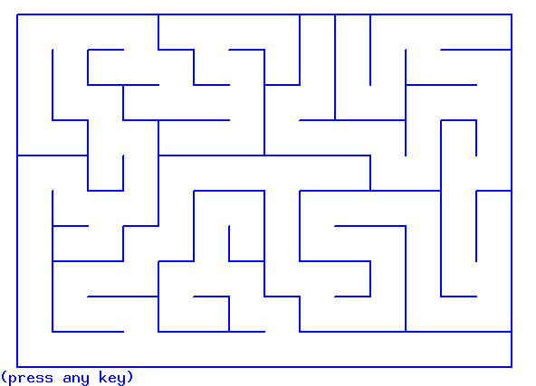

## intro

**sources principales:**

- [https://who.rocq.inria.fr/Simon.Cruanes/enseignement/tp_labyrinthe.pdf](https://who.rocq.inria.fr/Simon.Cruanes/enseignement/tp_labyrinthe.pdf)
- [http://info-llg.schola.fr/commun-mp/?a=td](http://info-llg.schola.fr/commun-mp/?a=td)

J'ai fait une partie des exs de info-llg en Ocaml, en modifiant
le code de Simon Cruanes.


## compilation et exécution

```
$ ocamlc -o labyrinthe.native graphics.cma unix.cma labyrinthe.ml
$ ./labyrinthe.native <numéro>
```

en remplaçant numéro par une valeur entre 0 et 6 (voir code source, 
fin du fichier **labyrinthe.ml**)


## génération de labyrinthes

#### génération par exploration exhaustive
  - La génération des labyrinthes est équivalente à la recherche
  d’un arbre couvrant minimal sur le graphe constitué d’une grille p×q
  et pour lequel toutes les arêtes ont le même poids
  - ici, méthode adaptée de l’algorithme de Prim; toutes les arêtes ont le même poids,
  pas besoin de trier les arêtes sortantes:
  ici parcours en profondeur qui creuse le labyrinthe
  - le labyrinthe généré est parfait


#### sources

- [https://who.rocq.inria.fr/Simon.Cruanes/enseignement/tp_labyrinthe.pdf](https://who.rocq.inria.fr/Simon.Cruanes/enseignement/tp_labyrinthe.pdf)

- [http://info-llg.schola.fr/commun-mp/?a=td](http://info-llg.schola.fr/commun-mp/?a=td)
- [http://info-llg.schola.fr/commun-mp/pdf/labyrinthe.enonce.pdf](http://info-llg.schola.fr/commun-mp/pdf/labyrinthe.enonce.pdf)
- [http://info-llg.schola.fr/commun-mp/pdf/labyrinthe.corrige.pdf](http://info-llg.schola.fr/commun-mp/pdf/labyrinthe.corrige.pdf)
- [http://www.irem.univ-bpclermont.fr/IMG/pdf/3Recouvrant.pdf](http://www.irem.univ-bpclermont.fr/IMG/pdf/3Recouvrant.pdf)
- [https://fr.wikipedia.org/wiki/Algorithme_de_Prim](https://fr.wikipedia.org/wiki/Algorithme_de_Prim)


## exploration de labyrinthes

**recherche en prodondeur, DFS: depth first search**




## mémo Ocaml

#### le type array est mutable

en particulier utilisé ici

```ocaml
type labyrinthe = square array array
```


#### tableau d'enregistrements avec champ mutable:

- [https://stackoverflow.com/questions/16326218/ocaml-array-of-record-with-mutable-field](https://stackoverflow.com/questions/16326218/ocaml-array-of-record-with-mutable-field)

- [http://caml.inria.fr/pub/docs/manual-ocaml/libref/Array.html](http://caml.inria.fr/pub/docs/manual-ocaml/libref/Array.html)

- Conchon/Filliâtre, Apprendre à programmer avec OCaml, 2.5, paragraphe 'Alias'

- Conchon/Filliâtre, Apprendre à programmer avec OCaml, 10.4 calcul matriciel

- [https://dev.realworldocaml.org/records.html](https://dev.realworldocaml.org/records.html)  (functional updates)

cad:

```ocaml
utop # let demo_maze = Array.make_matrix n p {east=false; north=false; west=false; south=false} ;;
```

ne fonctionnera pas, tous les éléments du tableau renverront physiquement
au même élément.

on utilise 
```ocaml
let init_maze n p f =
  Array.init n (fun i -> Array.init p (fun j -> f i j))
let demo_maze = 
    let m = init_maze 3 4 
              (fun _ _ -> {east=false; north=false; west=false; south=false}) in
    m.(0).(0).north <- true;
    m.(1).(0).south <- true;
    m.(1).(2).east <- true;
    m.(1).(3).west <- true;
    m
```


#### Ocaml Graphics

- `draw_rect x y w h` draws the rectangle with lower left corner at x,y,
width w and height h

- `draw_segments`

```ocaml
val draw_segments : (int * int * int * int) array -> unit
```

[https://ocaml.github.io/graphics/graphics/Graphics/index.html#point-and-line-drawing *)](https://ocaml.github.io/graphics/graphics/Graphics/index.html#point-and-line-drawing *))


#### Array.iteri

- [https://caml.inria.fr/pub/docs/manual-ocaml/libref/Array.html](https://caml.inria.fr/pub/docs/manual-ocaml/libref/Array.html)

```ocaml
val iteri : (int -> 'a -> unit) -> 'a array -> unit
```

Same as Array.iter, but the function is applied with the index of the element as first argument, and the element itself as second argument.
